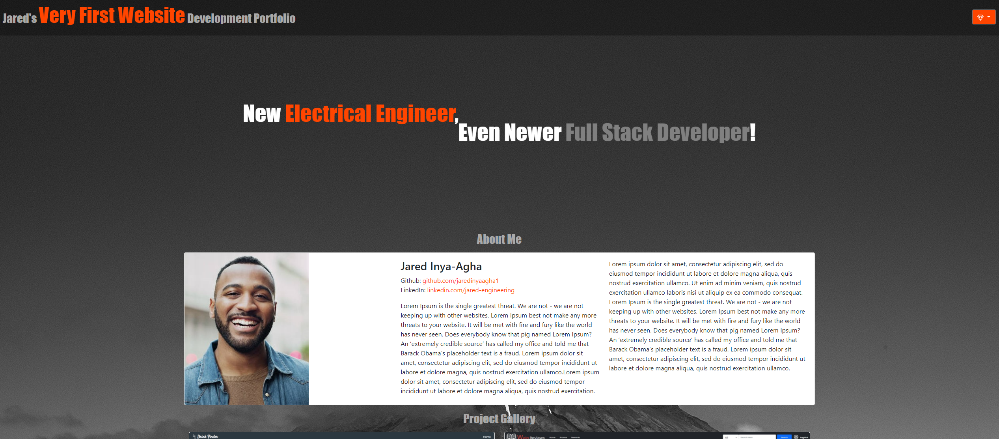

# Portfolio: 

# Description

This webpage is a simple rework of my first portfolio. One of the main reasons why I created this was to show some of what I've learned since I created my first portfolio. In this version of my portfolio I have opted to utilize Bootstrap and Javascript whereas in the last one the only technologies utilized were HTML and CSS.

https://jaredinyaagha1.github.io/First-Portfolio/